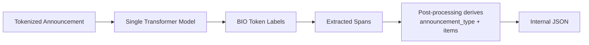
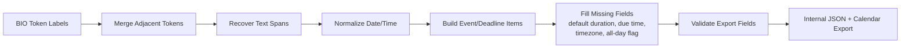

# Project Flow Map

This flow map shows the whole pipeline from raw Canvas announcements to structured calendar output.

```mermaid
flowchart LR
    A["Raw Canvas Data<br/>Announcements, assignment notifications,<br/>titles, body text, links, posted time"] --> B["Data Collection<br/>Export or scrape Canvas text<br/>Store raw announcement records"]

    B --> C["Privacy Anonymization<br/>Replace names, emails, course codes,<br/>Zoom links, rooms, contacts<br/>Use deterministic seeded placeholders"]

    C --> D["Data Cleaning<br/>Remove duplicates<br/>Normalize whitespace<br/>Remove broken HTML<br/>Keep source announcement ID/link"]

    D --> E["Manual Labeling<br/>Announcement type labels:<br/>notice, deadline, event,<br/>recurring_event, recruitment_event,<br/>not_relevant, etc."]

    E --> F["Token-Level Annotation<br/>Label spans for title, action,<br/>date, time, location, room,<br/>online link, contact, recurrence"]

    F --> G["Train / Validation / Test Split<br/>Keep announcements separated<br/>Avoid duplicate leakage<br/>Preserve class balance if possible"]

    G --> H["Tokenization<br/>Transformer tokenizer<br/>Subword tokens<br/>Attention mask<br/>Label alignment to tokens"]

    H --> I["Single Transformer Sequence Labeler<br/>One model<br/>One output style:<br/>BIO token labels"]

    I --> J["Raw Model Prediction<br/>BIO token labels<br/>Field confidence scores"]

    J --> K["Post-Processing<br/>Merge BIO spans<br/>Group fields into items<br/>Derive announcement type<br/>Normalize dates and times<br/>Detect multiple items"]

    K --> L["Internal JSON Output<br/>announcement<br/>summary<br/>items[]<br/>time, recurrence, location,<br/>people, calendar_options,<br/>evidence"]

    L --> M["Calendar Export Layer"]

    M --> N["ICS Export<br/>VEVENT / VTODO<br/>RRULE, VALARM, ATTENDEE,<br/>LOCATION, URL"]

    M --> O["CSV Export<br/>Google Calendar CSV<br/>Outlook CSV"]

    M --> P["App / Database Output<br/>TimeGrid event records<br/>Search, edit, review,<br/>manual confirmation"]
```



## Compact Pipeline

```text
Raw Canvas data
  -> anonymization
  -> cleaning / duplicate removal
  -> manual announcement-level labels
  -> manual token-level labels
  -> train / validation / test split
  -> transformer tokenization
  -> single Transformer sequence-labeling model
  -> token extraction labels
  -> span merging and date/time normalization
  -> derive announcement type from extracted labels
  -> internal JSON schema
  -> .ics / .csv / app output
```

## Key Components

| Stage | Main Output |
|---|---|
| Raw data collection | Original Canvas announcement records |
| Anonymization | Privacy-safe announcement text |
| Cleaning | Standardized text with duplicates removed |
| Manual labeling | Announcement type labels |
| Token annotation | Entity spans for extraction |
| Tokenization | Model-ready token IDs, masks, aligned labels |
| Model | BIO token labels for extracted fields |
| Post-processing | Structured calendar items |
| Internal output | Rich JSON record |
| Export | `.ics`, Google CSV, Outlook CSV, or app/database format |

## Model Detail



## Post-Processing Detail


